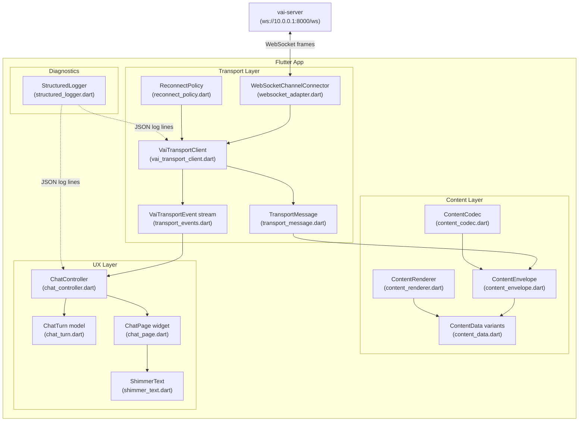
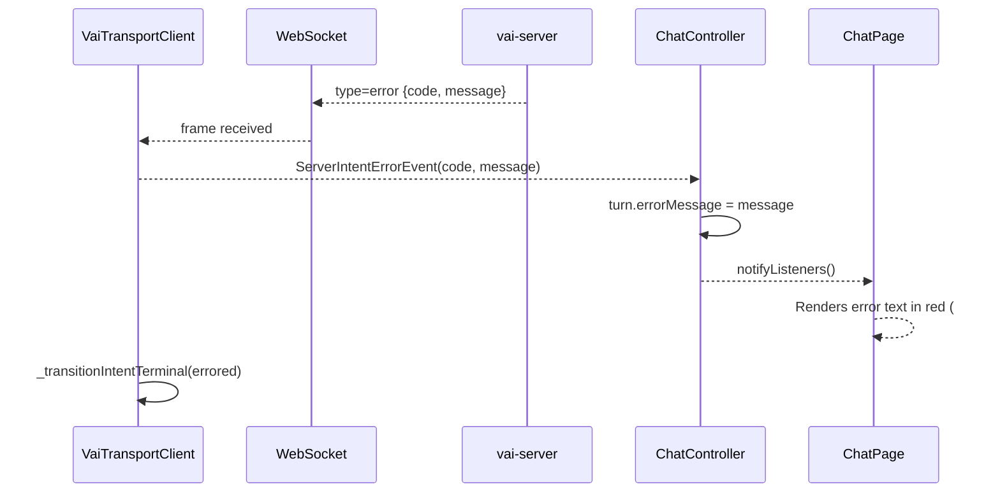

# vai-client

A Flutter mobile/desktop client for the Voice AI (VAI) assistant system.

The client pairs with the **vai-server** backend
([github.com/BrettMGoughWork/vai-server](https://github.com/BrettMGoughWork/vai-server))
over a private WireGuard tunnel (the server sits at `10.0.0.1:8000`; the client
reaches it at `ws://10.0.0.1:8000/ws`).

---

## What is it?

VAI is a conversational voice/text AI assistant. The client handles:

- Real-time streaming chat with the server over a persistent WebSocket
- Ephemeral progress messages (thinking indicators, partial work notes) that
  disappear when the final response arrives
- Streaming partial-text deltas that animate into the final answer
- Server-side error surfacing with a distinct visual treatment
- Auto-reconnect with exponential back-off

This codebase is a **prototype** - the goal was to get end-to-end streaming
working on device, not production polish.

---

## Architecture

### Layer overview

The codebase is split into four layers: **transport**, **content**, **ux**, and
**diagnostics**.



---

## Message flow

### Successful intent (streaming response)

```mermaid
sequenceDiagram
    actor User
    participant App as Flutter App
    participant TC as VaiTransportClient
    participant WS as WebSocket
    participant SRV as vai-server

    User->>App: Types prompt, hits Send
    App->>TC: sendIntentStarted(intentId, text)
    TC->>WS: intent_started {payload.input_mode="text"}
    TC-->>App: IntentStateChangedEvent(started)

    SRV-->>WS: intent_started (echo)
    TC-->>App: [duplicate ignored - already started]

    loop Thinking updates
        SRV-->>WS: ephemeral {content.text="..."}
        TC-->>App: ContentEvent(kind=ephemeral)
        App-->>User: Shows ephemeral bubble
    end

    loop Streaming deltas
        SRV-->>WS: partial_output {index, delta}
        TC-->>App: StreamChunkEvent + ContentEvent(kind=partial)
        App-->>User: Animates partial text
    end

    SRV-->>WS: final_output {content}
    TC-->>App: StreamCompletedEvent + ContentEvent(kind=finalResponse)
    App-->>User: Replaces partial/ephemeral with final bubble

    SRV-->>WS: intent_completed {payload.content}
    TC-->>App: ContentEvent(kind=finalResponse)
    Note over App,User: Final content already shown; intent lifecycle closed

    TC-->>App: IntentStateChangedEvent(completed)
```

### Error path



---

## Networking

The server lives behind a **WireGuard** VPN. After connecting to the VPN,
`10.0.0.1` resolves to the server host. The WebSocket URL defaults to
`ws://10.0.0.1:8000/ws` and can be overridden at build time:

```bash
flutter run --dart-define=VAI_WS_URL=ws://your-host:8000/ws
```

---

## Project structure

```
lib/
  main.dart                    # App entry-point, DI wiring
  src/
    transport/
      vai_transport_client.dart  # Core WS transport, intent lifecycle
      transport_events.dart      # Sealed event types emitted to UX
      transport_message.dart     # Incoming message parsing
      websocket_adapter.dart     # WebSocket abstraction
      reconnect_policy.dart      # Exponential back-off reconnect
      lifecycle.dart             # Connection/intent phase state machines
      timestamp.dart             # RFC 3339 timestamp helpers
      protocol_error.dart        # Typed protocol exception
    content/
      content_envelope.dart      # Top-level content wrapper
      content_data.dart          # TextContentData, etc.
      content_codec.dart         # JSON encode/decode
      content_renderer.dart      # Widget render logic
      content_type.dart          # Content type enum
    ux/
      chat_page.dart             # Root chat screen widget
      chat_controller.dart       # ChangeNotifier bridging transport to UI
      chat_turn.dart             # Immutable turn model (prompt + response)
      shimmer_text.dart          # Animated shimmer while streaming
    diagnostics/
      structured_logger.dart     # JSON-line structured logger
test/
  vai_transport_client_test.dart
  transport_message_test.dart
  chat_controller_test.dart
  chat_page_test.dart
```

---

## Related

- **vai-server** - Python FastAPI + WebSocket backend:
  [github.com/BrettMGoughWork/vai-server](https://github.com/BrettMGoughWork/vai-server)

---

## Running

```bash
# Install dependencies
flutter pub get

# Run on device / emulator (default server at ws://10.0.0.1:8000/ws)
flutter run

# Override server URL
flutter run --dart-define=VAI_WS_URL=ws://10.0.0.1:8000/ws

# Run tests
flutter test
```